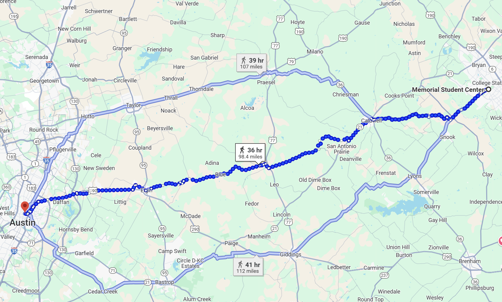
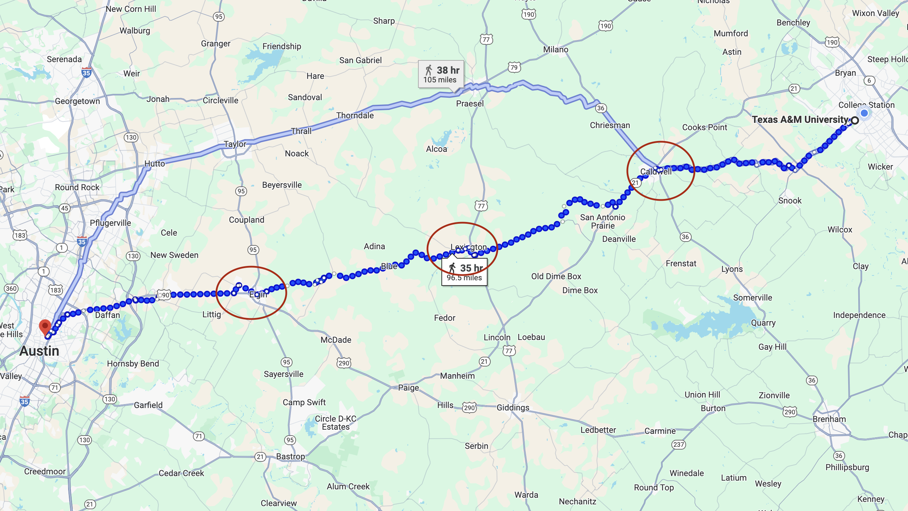
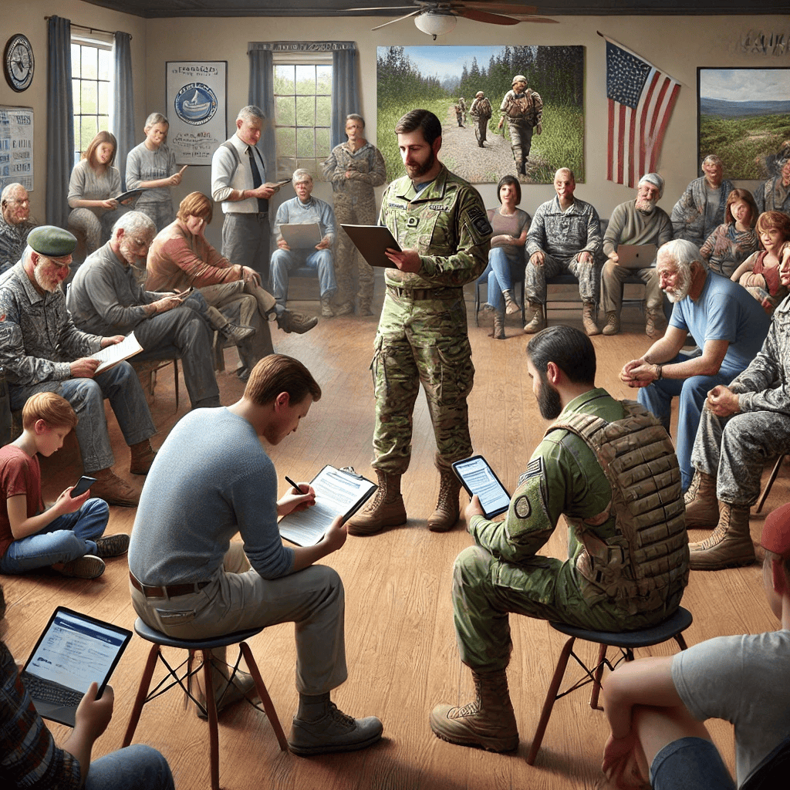
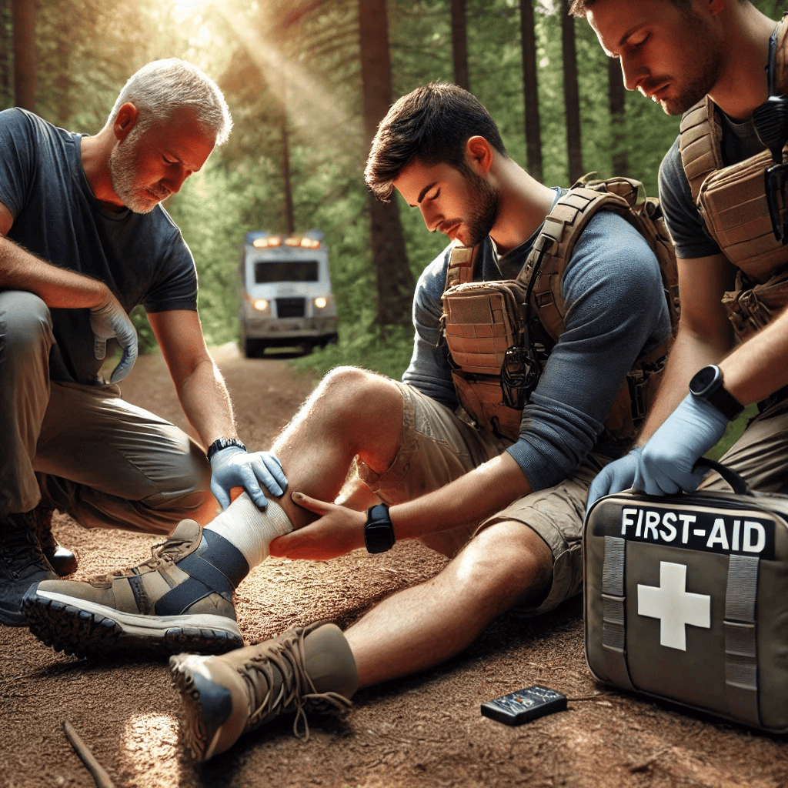
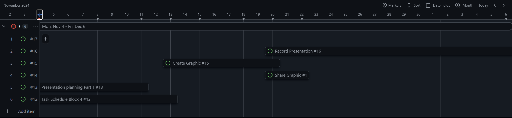
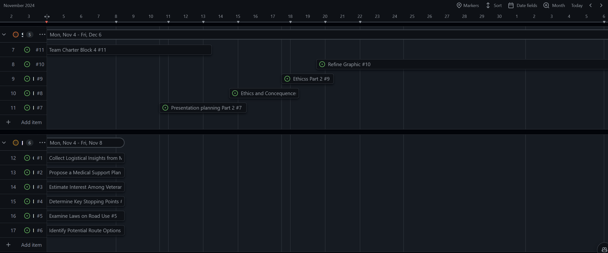

# Purpose

To research hurdles and plan logistics for a proposed hike from College Station to Texas University for the rivalry game in 2025. The game ball will be transported and delivered by student veterans and the Corps of Cadets to t.u. Traffic safety and route are the key focus, but we will also gauge interest.

# Summary

This research aims to plan and execute a hike of the game ball from College Station to TU, a distance of approximately 100 miles. This event represents a unique opportunity to strengthen the tradition between the two universities while also promoting camaraderie and visibility for the Student Veterans of America and the Corps of Cadets. The critical need is to ensure that the hike can be carried out safely, legally, and efficiently. We will research the logistics, including route mapping, safety measures, legal requirements, and if there are necessary permits.

# Introduction

Our team, **Make Cadets March**, proposes to research and develop a detailed plan to hike the game ball from College Station to Texas University (TU) in 2025 for the rivalry game. This research will culminate in the submission of a formal recommendation report, which will guide the Student Veterans of America (SVA) in planning this significant event.

Our primary research will involve interviewing key personnel at SVA and the other Veterans to gather insights into logistics for long hikes and gather feedback on potential concerns. We will also rely on published sources to support our proposal. One key source is the “Texas Transportation Code” (Title 7, Chapter 552), which outlines pedestrian and roadway regulations that must be followed.

Additionally, we will consult academic studies on pedestrian safety, including *Pedestrian Safety in Rural Areas*, published by the National Highway Traffic Safety Administration (NHTSA, 2018). Both sources will provide a framework for planning a safe and well-organized event.

The Bryan district pedestrian safety action plan from the Texas Department of Transportation provides essential data, including an infographic detailing high-risk zones for pedestrian accidents and the causes behind them (Texas Department of Transportation, 2017). This information provides insight into the statistically proven dangers of pedestrian traffic within the Bryan district.

From this data, we can conclude that regular pedestrian traffic alone is hazardous, let alone hiking hundreds of miles, showing that conducting this hike from College Station to TU without the necessary prior research would pose a considerable risk to the operation. Thus, we need to ensure that the hike can be conducted within a comfortable risk margin.

This information will help our team prioritize route safety, identify potential danger areas, and implement necessary precautions for the game ball hike. The statistics and visual representation will assist in careful planning and attention to safety, ensuring our proposal is well-founded and safe.

In conclusion, our team is prepared to conduct research to develop a viable and actionable plan for the hike of the game ball. We will use a combination of primary and secondary sources to ensure that all logistical, legal, and safety requirements are met or defined. The outcome of this research will be a detailed recommendation report aimed at the SVA leadership, with the ultimate goal of making this event a success. The presentation will follow APA guidelines for citing sources.

# Proposed Tasks

## Task 1: Identify Potential Route Options

To evaluate route options for hiking the game ball from College Station to Texas University, we will identify multiple feasible routes, considering time constraints and safety factors such as road type. Using Google Maps and Texas Department of Transportation resources, we will analyze each route's accessibility and legal allowances for pedestrian use, especially along highways and rural roads.

This task will include prioritizing multi-lane roads to ensure group safety and identifying areas with limited route options. To create a comprehensive comparison, we will document the available routes in detail, including distances and estimated travel times.

## Task 2: Determine Key Stopping Points

Once the primary route options are selected, we will identify potential stopping points along each route for rest and resupply. These stopping points should be located near facilities that provide essential services, such as restrooms and hydration stations.

Alternatively, places to stop and switch out the team of hikers for fresh cadets from College Station could be determined. We will use Google Maps to locate these points and verify the availability of rest areas, gas stations, or other relevant spots. We will also document the distance intervals between these points, aiming to create a structured itinerary for each route that ensures safety and convenience for participants.

## Task 3: Examine Texas Laws on Pedestrian Road Use

To ensure that the chosen routes comply with Texas state regulations, we will examine relevant sections of the Texas Transportation Code, mainly focusing on Title 7 Chapter 552, which covers pedestrian rights and restrictions on highways and Farm-to-Market roads. We will also confirm any group size limits for pedestrians to ensure compliance during the hike.

This information will be crucial in determining route eligibility and help finalize a legally viable route for the hike.

## Task 4: Collect Logistical Insights from Military Experts

For practical guidance on organizing a multi-day hike, we will collect logistical insights from retired military leaders, specifically focusing on challenges related to team rotation, safety vehicles, and group dynamics. We plan to conduct interviews with local military leaders and members of the Corps of Cadets who have experience in logistical planning for group activities.

In these interviews, we will ask about their experiences managing similar hikes or events, focusing on best practices for safety, team coordination, and efficient resource use. We will also ask for feedback on vehicle strategies, such as having a following or leapfrogging support vehicle. Their insights will be summarized to inform the event's logistics plan.

## Task 5: Estimate Interest Among Veterans and Cadets

We will estimate interest levels among the veteran community and the Corps of Cadets through a survey to gauge potential participation and support for the hike. The survey will be designed with 8-10 questions focused on willingness to participate, preferred roles (e.g., hiking, logistical support), and any safety or logistical concerns they may have.

We will distribute the survey through veteran and cadet social media groups and email lists using an online survey platform like Google Forms. We aim to obtain at least 20 responses to inform the planning process. We will analyze the results to understand participation trends and logistical requirements based on the expected number of attendees.

## Task 6: Propose a Medical Support Plan

To ensure participant safety, we will develop a comprehensive medical support plan for the hike, detailing equipment needs, personnel requirements, and response protocols. We will identify key points along the route where medical assistance can be accessed quickly, such as nearby hospitals or clinics.

This task will involve consulting local emergency medical professionals to establish response strategies. We will also identify any first-aid equipment and trained personnel needed on-site. The medical support plan will be incorporated into the final logistics plan, prioritizing participant safety throughout the event.

# Timeline

# Works Cited

- Texas Legislature. (2023). *Texas Transportation Code (Title 7, Chapter 552)*. Texas Statutes. [https://statutes.capitol.texas.gov/Docs/TN/htm/TN.552.htm](https://statutes.capitol.texas.gov/Docs/TN/htm/TN.552.htm).
- National Highway Traffic Safety Administration. (2018). *Pedestrian safety in rural areas*. U.S. Department of Transportation. [https://www.nhtsa.gov/](https://www.nhtsa.gov/)
- Texas Department of Transportation. (2017). *Bryan district pedestrian safety action plan*. Texas Department of Transportation. [https://ftp.txdot.gov/pub/txdot/tpp/psap-countermeasures-methodology-memo.pdf](https://ftp.txdot.gov/pub/txdot/tpp/psap-countermeasures-methodology-memo.pdf)
